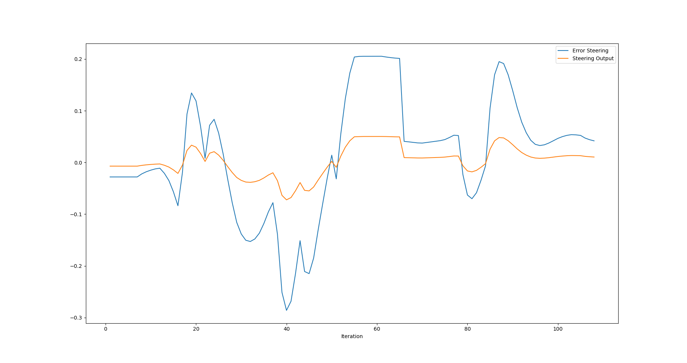
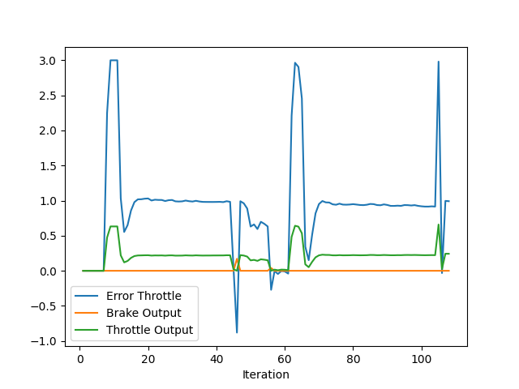

# PID Controller for Vehicle Trajectory Tracking
The objective of the project is to design a PID controller for accurate vehicle trajectory tracking. PID controllers offer a reliable and flexible solution for maintaining precise trajectory control in vehicle systems, effectively balancing simplicity and performance across various driving conditions. By adjusting the proportional, integral, and derivative gains, the PID controller ensures consistent and smooth tracking, even in dynamic or challenging environments.

## Evaluate and analyze the PID controller
The following PID parameters provide the best tuning results in CARLA simulation:
```cpp
pid_steer.Init(0.25, 0.0011, 0.09, 1.2, -1.2);
pid_throttle.Init(0.21, 0.0009, 0.07, 1.0, -1.0);
```
### The steering error result
The steering error represents the difference between the vehicle's current position and the desired trajectory.

Initially, the error fluctuates around zero but displays notable spikes both positively and negatively as time progresses. These fluctuations may indicate oscillations in the PID controller’s response, potentially resulting from tuning issues, such as an excessively high proportional or derivative gain. High gains can lead to overshooting and sustained oscillations around the desired trajectory.

The error does not trend consistently toward zero, which suggests that the controller may be struggling to fully correct the error. This could be due to an insufficient integral gain, limiting the controller’s ability to eliminate accumulated error over time and reach a steady-state condition.

The steering output line shows relatively smoother changes, but it does not appear to fully counteract the error, this is indicating of clamping/ limiting of the control signal.


### The throttle error result
The throttle error shows sharp peaks early on and around the middle of the iterations, followed by drops and periods of relatively steady values.
The sharp spikes in error suggest that the ego experiences sudden deviations from the desired speed. This might be due to stopped car in front of ego. Also, the pattern of repeated spikes could indicate that the controller is not effectively reducing the error to zero over time, possibly due to insufficient integral gain.


### Q: How would you design a way to automatically tune the PID parameters
To automatically tune PID parameters, one effective approach is to use the Twiddle algorithm (Coordinate Descent), which iteratively adjusts parameters to minimize a specified error metric, like mean squared error. Twiddle automates the tuning process, though it can take time to converge, especially in complex systems.

Other methods include:

Genetic Algorithms (GA): These use evolutionary principles to optimize parameters over multiple generations, suitable for complex systems.

Bayesian Optimization: This approach efficiently balances exploration and exploitation, making it useful for systems where error evaluations are computationally costly.

Reinforcement Learning (RL): RL methods adapt PID parameters based on real-time feedback, ideal for dynamic environments.

Each method offers strengths, with the choice depending on system complexity and resource availability.

### Q: PID controller is a model free controller, i.e. it does not use a model of the car. Could you explain the pros and cons of this type of controller
Pros:
- Simplicity and Ease of Implementation: Since a PID controller doesn’t require a model of the system, it’s relatively easy to design, implement, and tune compared to model-based controllers.
- Broad Applicability: It works well across a wide range of systems without needing detailed knowledge of system dynamics, making it versatile for different vehicles or scenarios.
- Real-time Responsiveness: PID controllers respond directly to error signals in real time, which can be beneficial for applications requiring immediate adjustments.

Cons:
- Limited Accuracy: Without a model of the system, a PID controller may struggle with complex or highly nonlinear dynamics, leading to suboptimal performance or instability in such systems.
- Difficulty in Handling External Disturbances: Model-free controllers often have trouble compensating for disturbances or time-varying behavior, as they lack predictive capability.
- Tuning Challenges: Finding the right PID gains can be difficult, especially as operating conditions change. Model-free tuning methods (like Twiddle) may require time and numerous iterations to adapt.

### Q: What would you do to improve the PID controller? This is an open question
To improve the current implementation, the following steps could be considered:
- Apply the Twiddle algorithm: Implement the Twiddle algorithm to find optimal PID parameters. This iterative optimization technique adjusts the parameters (proportional, integral, and derivative gains) and fine-tunes them to achieve better performance.
- Verify performance across scenarios: Test the optimized PID controller under different simulation scenarios to ensure its robustness and adaptability. It's important to validate that the chosen parameters work well in diverse conditions.