## Project overview
Object detection is one of the major parts of the autonomous driving system.
The self-driving car shall understand the surrounding in order to perform a correct maneuver and avoid collisions, especially in urban environments, where a lot of objects influence self-car behavior.

In this project a convolutional neural network to detect and classify objects using [Waymo Open dataset](https://waymo.com/open/).
Firstly, analyses of the given dataset will be performed to decide what augmentations are meaningful for this project and how to split the data into training, validation, and test sets.
After that, the training of the neural network will be performed. And then experiments with different hyperparameters to improve the model's performance.

## Exploratory Data Analysis (EDA)
20000 images from the data set were analyzed to get more understanding of the dataset, e.g. the number of objects for each class, the number of bounding boxes on an image, etc.
(functions used for analysis are located in Exploratory_Data_Analysis.ipynb)
* The dataset contains some images that were done during nighttime as well as in rainy/foggy conditions, but the majority of images represent the daytime.
This observation was done based on visual analysis of the random images from the data set.
* Number of cars is ~3.3 times more than pedestrians and ~128 times more than cyclists.
It might mean that the test set was collected from drives in areas where not many people are going around (sleeping quarters, highways, or motorways).
The numbers of pedestrians and cyclists are not sufficient to create a robust model which will perform well in Urban Environment with high-density people/cyclist.
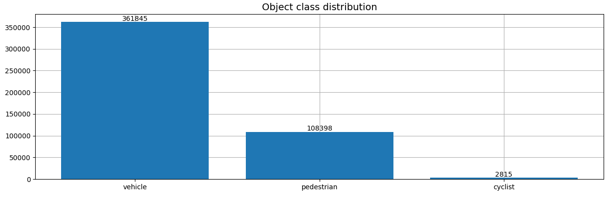
* ~26% of the analyzed data contains up to 9 objects and ~24% has 10–19 objects. Thereby, the analyzed data is shown that ~50% contains up to 19 objects and ~9 % images with a number of objects more than 50.
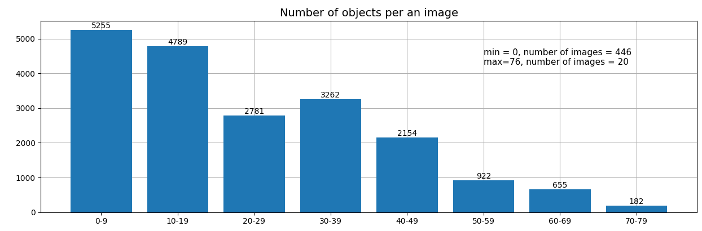
* Analyzed data is shown that there is a significant amount of bounding boxes with area less than 5x5 pixels (the smallest on the plot). The bigger amount of bounding boxes have area from 5x5 up to 15x15 pixels (small on the plot). Although the biggest part of bounding boxes has area from 15x15 up to 100x100 pixels (medium on the plot).
Also, there are larger bounding boxes with areas from 100x100 pixels up to 640x640.

  The majority of bounding boxes have medium areas and the majority of images have a lot of objects (see plot above) therefore, it might mean that some objects overlap and not all information is defined by the camera. Also, 78 bounding boxes have 640x640 which is the image boundary.
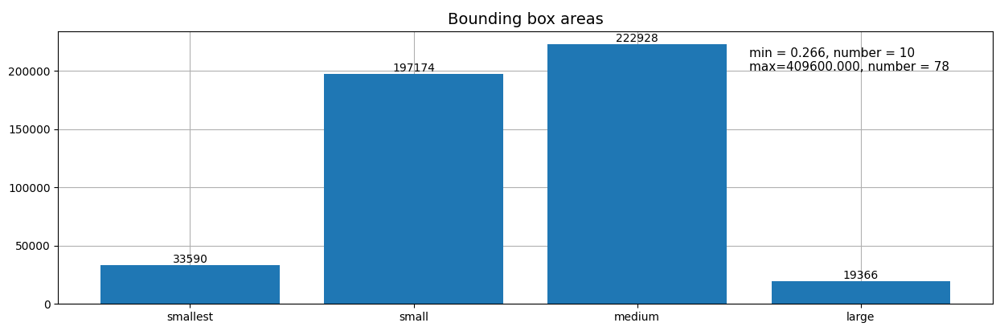

## Data splits
Based on dataset analysis, it's clear that images from the same record have similar characteristics such as the number of objects, highway or urban environment, and weather conditions. Therefore, the data split will be done based on trip Ids.
In the first step, all trip records are shuffled, and then all data is split with a ratio of 75% - for training, 15% - for validation, and 10% - for test sets based on the cross-validation approach in the corresponding folders (data/train, data/val, data/test), for that split_data.py script is used.

*The decision about including test in the data split step is done because of data/test folder contains 3 records (links to waymo data) instead of 10 as it said in the project instruction. these 3 records are considered part of the data set, they stay in the test folder, but additional records is added, proportion 75/15/10 remains.*

*In order to use split_data.py script several times, the input folder for all records shall be changed, and parameter addition_number_of_records if needed (this parameter is used in order to keep links to records in the test folder and at the same time keep the ratio 75/15/10)*

## Training
### Experiment 0 (Reference)
This is reference experience with the model [SSD Resnet 50 640x640 model](http://download.tensorflow.org/models/object_detection/tf2/20200711/ssd_resnet50_v1_fpn_640x640_coco17_tpu-8.tar.gz)
Results of Loss and DetectionBox_Recall/Precision (see plots below) are the starting point for the model improvements.

The loss curve decreases during the training stage (see the plot below). The evaluation loss is higher than the training loss, e.g. training classification loss is 0.6873, and the evaluation loss is 0.9881.
The loss curve is going to plateau near the end of the training phase.
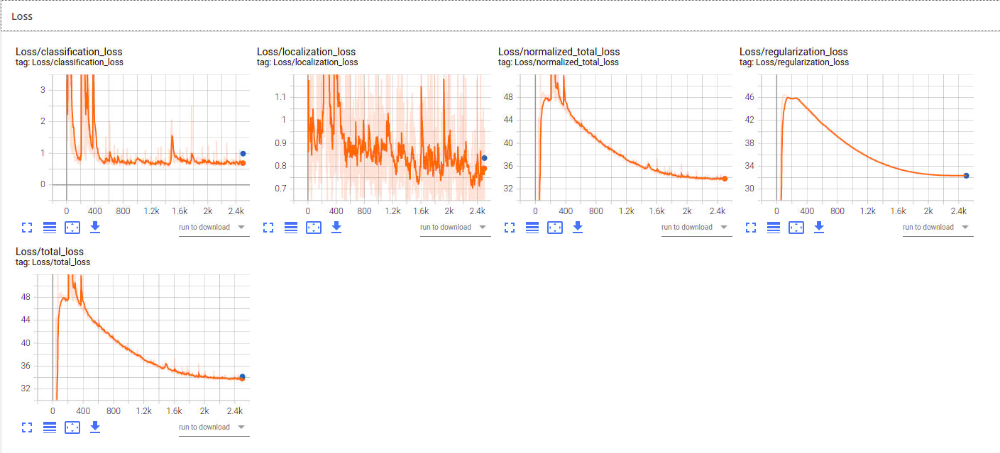

Detection box recall shows that the model detects medium and large objects better than small ones, the precision metric is the same for all sizes of objects.
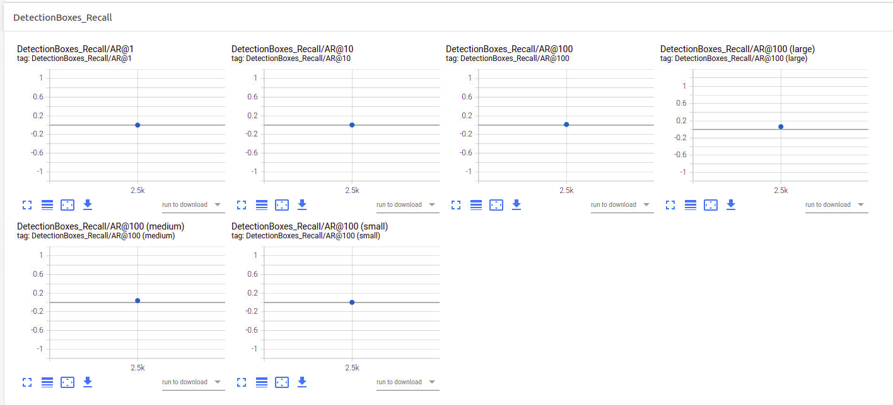
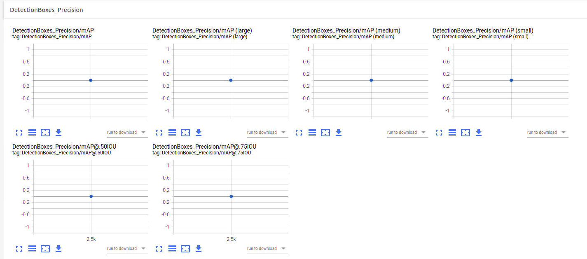

## Improve the performances

### Data augmentation, Experiment 1
The following data augmentation options are added in pipeline_config file (see visualization in Explore augmentations.ipynb), *baseline augmentation options are in place*:
* Randomly convert entire image to grey scale, probability 0.2
* Randomly changes image brightness by up to 0.3
* Randomly alters hue by a value of up to 0.04
* Randomly scales contrast by a value between [0.8, 1.15]
DetectionBox_Recall/Precision results have not been improved. The training classification loss is 0.8245, and the evaluation classification loss is 0.7036 which is slightly improved in comparison to the baseline.
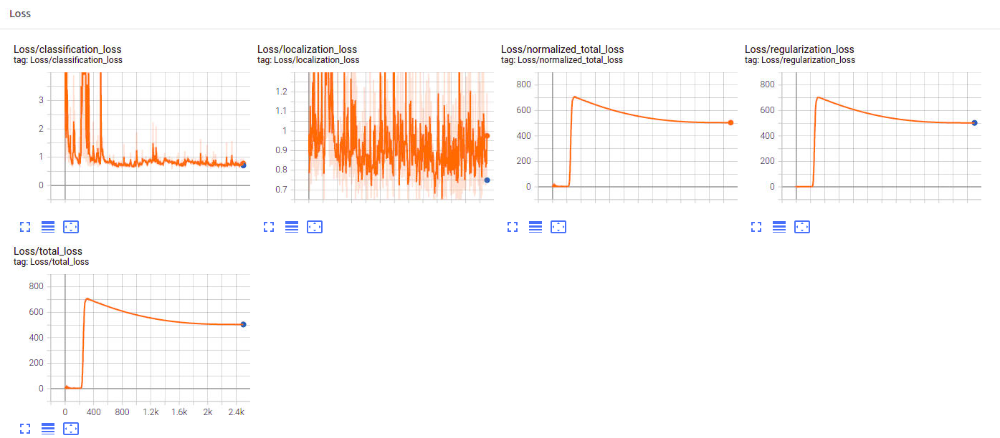
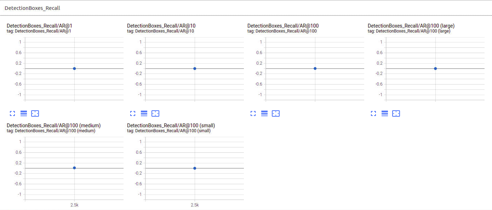
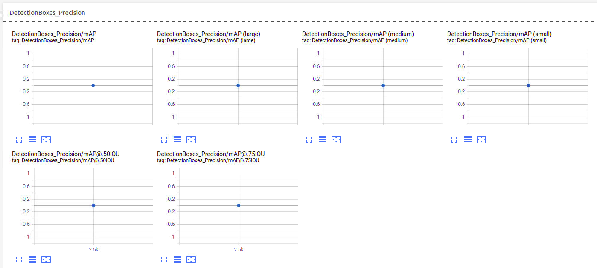

### Data augmentation, Experiment 2
The following data augmentation options are added in pipeline_config file (see visualization in Explore augmentations.ipynb), *baseline augmentation options are in place*:
* Randomly convert entire image to grey scale, probability 0.2
* Randomly changes image brightness by up to 0.3
* Randomly alters hue by a value of up to 0.04
* Randomly add a path as gaussian noise (probability of keeping the original image -0.8, patch size 1-50, standard deviation of the gaussian noise applied within the patch - 0.3)
DetectionBox_Recall/Precision results are on the same level as the baseline. The training classification loss is 0.6967, and the evaluation classification loss is 1.058 which is comparable with the baseline.
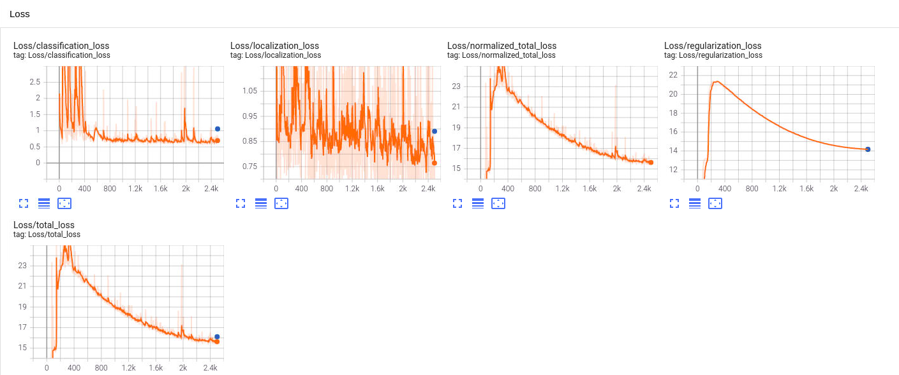
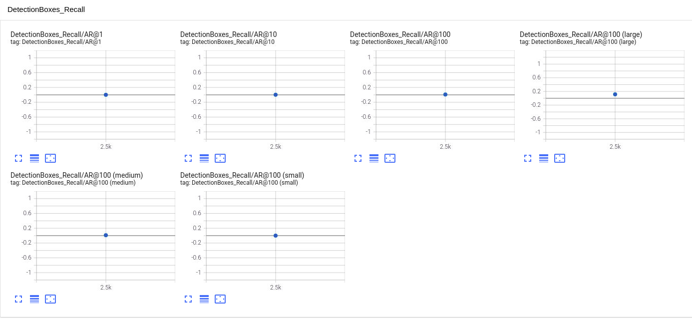
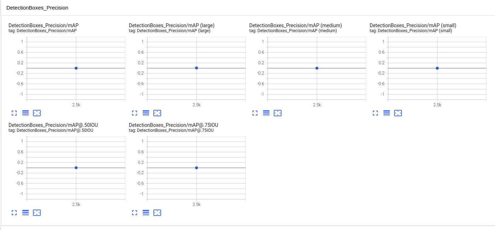

### Result
In the end, after the training step and exporting of the trained model, the object detection with the model was run on some test records from the test set (see animation below).

## Conclusions
Proposed changes in augmentation didn't lead to improvement of the Model. Also, during the experiment, it was found that losses are high. In order to improve the model,  the optimizer can be changed as well as the number of iterations or to change the learning rate. As well as other parameters in the config file.