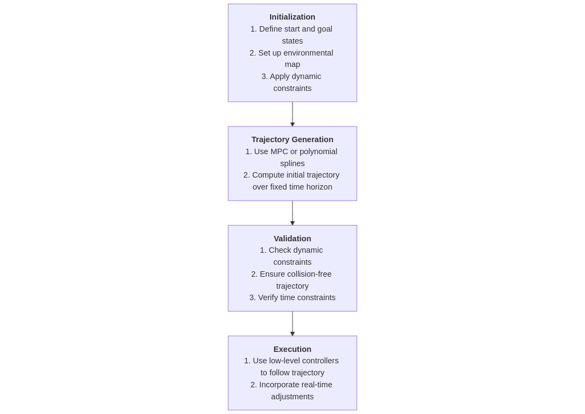

# Q: Explain some of the different techniques used for global planning (such as at a city map level) vs. micro planning (such as planning on how to go from the entrance of a parking lot to a desired space). Show how you could implement techniques from these levels into one end-to-end algorithm to guide a mobile robot from one distant location to another.

## Global planning (such as at a city map level) vs. micro planning (such as planning on how to go from the entrance of a parking lot to a desired space):

Global planning focuses on generating a high-level, long-distance path from a start location to a distant goal, usually across a city/large-scale environment. Common techniques include:
- Graph-based algorithms: Algorithms like Dijkstra's or A* use a pre-defined graph of the map where nodes represent waypoints, and edges represent possible routes. A heuristic (e.g., Euclidean distance) improves efficiency in A*.
- Probabilistic Roadmaps (PRM): Useful in environments where graphs are not predefined. PRM samples random points in the environment, connects them into a graph, and searches for the shortest path.
- Cost Maps: Cost-based planning takes into account traffic, terrain, or other dynamic factors to find an optimized route.\
Additional techniques may be employed for global planning based on the environment's complexity and specific requirements.

## Micro planning (such as planning on how to go from the entrance of a parking lot to a desired space):
Micro planning deals with short-range, fine-tuned path adjustments to navigate specific environments, like a parking lot or crowded street. Techniques include:

- Dynamic Window Approach (DWA): A local trajectory planner that considers the robot's kinematics and real-time obstacle avoidance within its velocity limits.
- Model Predictive Control (MPC): Generates a trajectory by solving an optimization problem over a short time horizon, balancing control inputs and constraints like avoiding obstacles or staying on track.
- Spline-Based Planning: Smooth path generation for precision tasks, such as aligning to a parking space.

## Show how you could implement techniques from these levels into one end-to-end algorithm to guide a mobile robot from one distant location to another.
The core idea is to integrate global and micro planning into a cohesive end-to-end algorithm. This approach ensures efficient, adaptive navigation for a mobile robot, even in complex environments. Below is an explanation of the components, along with diagrams illustrating the process:
1. Global Planning:
A global planner, such as A*, is used to compute an initial path on a city-scale road network. This step involves:
    - Representing the environment as a graph or high-level grid.
    - Calculating a path from the start to the destination while factoring in terrain, traffic, and other constraints.
    - Segmenting the global path into waypoints, which act as intermediate goals for the local planner.
2. Local Path Planning:
    - Use the Dynamic Window Approach (DWA) to navigate towards the next waypoint while avoiding dynamic obstacles like pedestrians or other vehicles.
    - For precise navigation in confined spaces (e.g., parking lots or narrow lanes), transition to Model Predictive Control (MPC), which ensures smooth and accurate maneuvering.
3. End-to-End Integration: The global and local planners are integrated into a hierarchical system:
    - The global planner provides high-level guidance by defining waypoints.
    - The local planner ensures safe, real-time adjustments to follow the global path while adapting to dynamic changes in the environment.
4. Feedback Mechanism: Sensors like LiDAR, cameras, and GPS continuously monitor the environment. If obstacles or deviations render the current path invalid, the global planner is re-triggered to replan the route dynamically.\
Diagrams below illustrate the end-to-end algorithm and its hierarchical structure:


# Q: How do you would generate a desired trajectory over a fixed time horizon for a robot traveling at high speed? Consider what information you would need in order to determine a reasonable trajectory, as well as any additional constraints you may need to consider.
To generate a desired trajectory over a fixed time horizon for a robot traveling at high speed, the following steps and considerations are essential:
1. Information Required
To determine a reasonable trajectory, gather the following inputs:
    - Start and Goal States:
        - Initial position, velocity, and orientation of the robot.
        - Desired endpoint and final velocity within the fixed time horizon.
    - Environment Data:
        - Static and dynamic obstacles in the robot's path.
        - Map of the environment (e.g., grid map, occupancy map).
    - Robot Dynamics and Kinematics:
        - Maximum velocity, acceleration, and deceleration limits.- - Turning radius and motion model (e.g., bicycle model, differential drive).
    - External Conditions:
        - Road friction, wind, or other external forces that may impact motion.
    - Time Horizon:
        - The fixed time period within which the trajectory must be completed.
2. Generating the Trajectory
    - Planning Techniques
        - Use MPC:
            - MPC optimizes the trajectory over a rolling time horizon by solving a cost function while considering constraints.
            - Cost function may include terms for minimizing deviation from the goal, energy consumption, and maintaining safety margins.
        - Polynomial Trajectory Generation:
            - Generate smooth trajectories using splines or quintic polynomials that satisfy boundary conditions (position, velocity, and acceleration at start and goal).
    - Discretization
        - Divide the time horizon into small intervals. For each interval, compute intermediate states using the selected planning algorithm.
        - Ensure continuity of position, velocity, and acceleration across intervals.
3. Constraints to Consider
    - Dynamic Constraints:
        - Respect robot kinematics (e.g., maximum turning angle or angular velocity).
    - Maintain feasible accelerations to prevent slipping or instability.
    - Collision Avoidance:
        - Ensure the trajectory keeps the robot at a safe distance from static and moving obstacles.
        - Use real-time sensor data for updates if the environment is dynamic.
    - Time Constraints:
        - Ensure the trajectory can be executed within the fixed time horizon.
    - Control Limitations:
        - Consider actuator delays and limits when designing feasible control inputs.
4. Real-Time Adjustments
    - Continuously monitor the environment using sensors (e.g., LiDAR, cameras).
    - Implement a feedback mechanism to adapt the trajectory dynamically if obstacles or unforeseen changes occur.
    - Recompute or refine the trajectory over a shorter time horizon if deviations are detected.
    
Workflow is presented below:


# Q: [Code] Explain the concepts behind a rapidly-exploring random tree (RRT), and implement an example in code.
The RRT algorithm is a popular technique for finding a path from a start state to a goal state in high-dimensional or complex spaces. Here's a breakdown of the key concepts:

Core Idea:
- RRT incrementally builds a tree rooted at the start position by randomly sampling the search space.
- The algorithm biases exploration towards unexplored regions, making it efficient in high-dimensional spaces.

Steps:
- Sampling: Randomly sample a point in the search space.
- Nearest Neighbor: Find the closest node in the current tree to the sampled point.
- Extension: Extend the tree by moving a small step from the nearest neighbor towards the sampled point.
- Goal Check: If the extended tree reaches the goal region, terminate the search.

Advantages:
- Efficiently explores large or complex spaces.
- Handles high-dimensional planning problems effectively.

Constraints:
- The algorithm can be adapted to consider obstacles by checking for collisions during the extension step.

## Code
```cpp
#include <iostream>
#include <vector>
#include <cmath>
#include <cstdlib>
#include <ctime>
#include <limits>

namespace{
struct Point {
    double x, y;

    Point(double x = 0.0, double y = 0.0) : x(x), y(y) {}
};
}

class RRT {
private:
    Point start, goal;
    std::vector<Point> tree;
    std::pair<Point, Point> map_limits;
    double step_size;
    int max_iterations;

    // Calculate the Euclidean distance between two points
    double distance(const Point& p1, const Point& p2) {
        return std::sqrt(std::pow(p2.x - p1.x, 2) + std::pow(p2.y - p1.y, 2));
    }

    // Find the nearest node in the tree to a given point
    Point nearestNode(const Point& sample) {
        double min_dist = std::numeric_limits<double>::max();
        Point nearest;
        for (const auto& node : tree) {
            double dist = distance(node, sample);
            if (dist < min_dist) {
                min_dist = dist;
                nearest = node;
            }
        }
        return nearest;
    }

    // Steer from one point to another, limited by the step size
    Point steer(const Point& from_node, const Point& to_node) {
        double direction_x = to_node.x - from_node.x;
        double direction_y = to_node.y - from_node.y;
        double dist = std::sqrt(direction_x * direction_x + direction_y * direction_y);
        
        if (dist > step_size) {
            direction_x = direction_x / dist * step_size;
            direction_y = direction_y / dist * step_size;
        }

        return Point(from_node.x + direction_x, from_node.y + direction_y);
    }

public:
    RRT(const Point& start, const Point& goal, const std::pair<Point, Point>& map_limits,
        double step_size, int max_iterations)
        : start(start), goal(goal), map_limits(map_limits), step_size(step_size), max_iterations(max_iterations) {
        tree.push_back(start);
    }

    // Main RRT planning algorithm
    std::vector<Point> plan() {
        srand(static_cast<unsigned>(time(0))); // Seed random number generator

        for (int i = 0; i < max_iterations; ++i) {
            // Sample a random point within the map limits
            double random_x = map_limits.first.x + static_cast<double>(rand()) / RAND_MAX * 
                              (map_limits.second.x - map_limits.first.x);
            double random_y = map_limits.first.y + static_cast<double>(rand()) / RAND_MAX * 
                              (map_limits.second.y - map_limits.first.y);
            Point random_sample(random_x, random_y);

            // Find the nearest node in the tree
            Point nearest_node = nearestNode(random_sample);

            // Steer towards the random sample
            Point new_node = steer(nearest_node, random_sample);

            // Add the new node to the tree
            tree.push_back(new_node);

            // Check if the goal is reached
            if (distance(new_node, goal) <= step_size) {
                tree.push_back(goal);
                return tree;
            }
        }

        std::cout << "Max iterations reached without finding a path." << std::endl;
        return tree;
    }
};

// main
// Point start(0, 0);
// Point goal(8, 8);
// std::pair<Point, Point> map_limits(Point(-1, -1), Point(10, 10));
// double step_size = 0.5;
// int max_iterations = 1000;

// RRT rrt(start, goal, map_limits, step_size, max_iterations);
// std::vector<Point> tree = rrt.plan();
```
To otmaze the path RRT* can be used.
