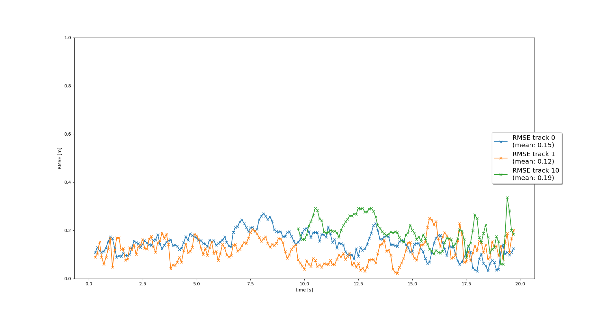

# Sensor Fusion and Object Tracking
## Summary of the Tracking Steps
### 1. Track objects over time with a Kalman Filter
The task involves implementing an Extended Kalman Filter (EKF) to track a single real-world
target using lidar measurement data collected over time. The EKF is applied to a simple single-target
scenario using only lidar inputs.
##### System Model
For this project, we assume constant velocity in 3D, and the state transition matrix 𝐹
for the system is defined as follows:\
$`F = \begin{pmatrix} 1 & 0 & 0 & dt & 0 & 0 \\
                  0 & 1 & 0 & 0 & dt & 0 \\
                  0 & 0 & 1 & 0 & 0 & dt \\
                  0 & 0 & 0 & 1 & 0 & 0 \\
                  0 & 0 & 0 & 0 & 1 & 0 \\
                  0 & 0 & 0 & 0 & 0 & 1\end{pmatrix}`$
##### Process Noise Covariance Matrix
The process noise covariance matrix 𝑄 is defined as:\
$`Q = E[vv^T] = \begin{pmatrix} 0 & 0 & 0 & 0 & 0 & 0 \\
                  0 & 0 & 0 & 0 & 0 & 0 \\
                  0 & 0 & 0 & 0 & 0 & 0 \\
                  0 & 0 & 0 & q & 0 & 0 \\
                  0 & 0 & 0 & 0 & q & 0 \\
                  0 & 0 & 0 & 0 & 0 & q\end{pmatrix}`$\
Where 𝑞 represents the process noise for the acceleration in each direction.
The integral over time to compute 𝑄 is:\
$`Q = \int_0^{dt}F(t)*Q*F(t)^T dt =
  \begin{pmatrix} qt^3/3 & 0 & 0 & qt^2/2 & 0 & 0 \\
                  0 & qt^3/3 & 0 & 0 & qt^2/2 & 0 \\
                  0 & 0 & qt^3/3 & 0 & 0 & qt^2/2 \\
                  qt^2/2 & 0 & 0 & qt & 0 & 0 \\
                  0 & qt^2/2 & 0 & 0 & qt & 0 \\
                  0 & 0 & qt^2/2 & 0 & 0 & qt\end{pmatrix}`$
##### EKF Predict Step
The prediction step of the EKF is computed as follows:\
$`x ^-= F * x ^+`$\
$`P^- = F * P^+ * F ^T + Q`$
##### EKF Update Step
The update step equations are:\
$`\gamma= z - H * x`$\
$`S = H * P^- * H^T + R`$\
$`K = P ^- * H ^T * S^{-1}`$\
$`x^+= x^- + K * \gamma`$\
$`P^+ = (I - K * H) * P ^-`$\
The RMSE plot for the tracking process shows an average RMSE of 0.32
for frames 150 to 200 in Sequence 2, as seen in the figure below:

### 2 Track Management Implementation
The task involves implementing track management functionality.
This includes initializing and deleting tracks, assigning a track state,
and calculating a track score to assess the quality and reliability of
each track over time.\
The result shows that a new track is automatically initialized when
unassigned measurements are detected, and the true track is confirmed
shortly thereafter.\

The RMSE plot for the tracking process displays a consistent line with 
an average RMSE of 0.78 for frames 65 to 100 in Sequence 2, as shown in the figure below:\

### 3 Nearest Neighbor Data Association and Multi-Target Tracking
The task is to implement a single nearest neighbor data association
method to correctly match measurements to existing tracks.
- The process begins with the implementation of the nearest neighbor data association,
which includes constructing an association matrix. This matrix helps in determining
the most likely correspondence between measurements and tracks.
- Additionally, a method is developed to return the nearest track and corresponding
measurement for association, ensuring that each measurement is only assigned to one
track and vice versa.
- To reduce the complexity of the association process, a gating method using
the chi-square distribution is applied. This technique ensures that only feasible
track-measurement pairs, within a defined confidence region, are considered for association.
- Once the data association is applied to a sequence with multiple targets,
the system updates multiple tracks with the appropriate measurements.

The visualization demonstrates tracking results with 3 distinct tracks 
across frames 0 to 200 in Sequence 1:\

The RMSE plot shows that tracks 0 and 1 were successfully tracked over all 200 frames
with an average RMSE of 0.15 and 0.12. Additionally, track 10, which appeared later,
was also tracked with 0.19:\

### 4 The nonlinear camera measurement model
The following steps were completed to integrate measurements from lidar and camera:
- Implemented camera measurements, including an appropriate covariance matrix 𝑅.
- Developed a nonlinear camera measurement model $`h(x)=\begin{pmatrix}c_i - (p_y * f_i)/p_x\\
                                                                      c_j - (p_z * f_j)/p_x\end{pmatrix}`$
- Provided the Jacobian 𝐻 for the measurement model.
- Created a method to check if an object is within the camera’s field of view.

The tracking loop correctly updates all tracks first with lidar measurements, then with camera measurements
(console output confirms lidar updates are followed by camera updates):\

The RMSE plot shows that tracks 0 and 1 were successfully maintained over all 200 frames, with average RMSE values 
of 0.17 and 0.10, respectively. Additionally, track 14, which appeared later, was tracked with comparable accuracy,
achieving an average RMSE of 0.13:

The visualization demonstrates accurate tracking performance throughout and no confirmed ghost tracks or track losses should occur:\

##  Benefits of Camera-Lidar Fusion
Lidar sensors provide accurate distance measurements and are highly effective
in detecting the spatial location of objects, even in poor lighting conditions.
However, they lack detailed appearance information, which can lead to
challenges in distinguishing between objects of similar size or shape.
By integrating camera data, which provides high-resolution color and
texture details, the fusion system can better identify and differentiate
between objects.
Additionally, cameras have a wider field of view and are more
cost-effective, while lidar is reliable in depth estimation.
Combining both sensors leverages their unique strengths,
creating a system that is both precise in range estimation and rich in
visual detail, leading to more robust tracking in complex environments.\
In this project, camera-lidar fusion demonstrated a clear improvement in
tracking performance compared to lidar-only tracking. Specifically,
the fusion approach resulted in fewer “ghost tracks”.
The RMSE for multi-target tracking decreased significantly, indicating
a more accurate association between measurements and tracks.
##  Challenges in Real-Life Sensor Fusion
Implementing sensor fusion in real-world scenarios presents significant
challenges, including environmental variability, sensor noise, and data
synchronization.\
Weather changes, lighting conditions, and obstacles can reduce the
accuracy of sensors. For instance, fog affects lidar’s range accuracy,
while low-light conditions limit camera effectiveness.\
Each sensor type introduces noise and requires precise calibration.
Misalignment between camera and lidar data can lead to tracking errors,
requiring accurate calibration and noise-handling methods.\
Another challenges is the data synchronization. Differences in sensor
frame rates complicate real-time fusion.
Without effective synchronization, fused data can represent slightly
different moments, impacting tracking precision.
## Future Improvements
In this project, a standard EKF is used; however,
incorporating more sophisticated filtering algorithms,
such as Particle Filters or Unscented Kalman Filters (UKF),
could improve tracking accuracy. These methods can better handle
non-linearities and non-Gaussian noise, making them suitable for
complex environments. Additionally, implementing machine learning
models for object classification and behavior prediction could enhance
the system's ability to manage dynamic environments.
This improvement would enable more intelligent tracking and
anticipation of object movements, leading to better overall performance.
