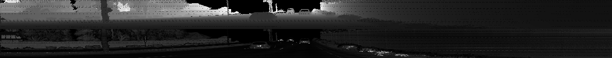
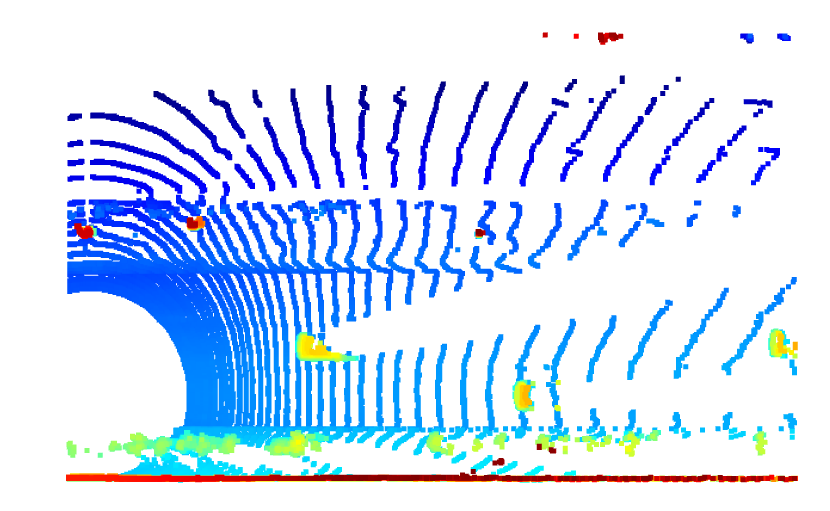

# Track 3D-Objects Over Time
### 1. Compute Lidar Point-Cloud from Range Image
#### 1.1 Visualize range image channels
This task is about extracting and visualizing lidar data from the Waymo Open dataset,
where lidar data is stored as a range image. The goal is to extract two specific data channels,
"range" and "intensity," from the range image and convert the floating-point data into an 8-bit integer value range.
After processing, use the OpenCV library to stack the range and intensity images vertically and visualize the combined output.



The changes have been made in `the objdet_pcl.py` file:
```python
def show_range_image(frame, lidar_name):
    # step 1 : extract lidar data and range image for the roof-mounted lidar
    lidar = [data for data in frame.lasers if data.name == lidar_name][0]
    
    # step 2 : extract the range and the intensity channel from the range image
    ri = dataset_pb2.MatrixFloat()
    ri.ParseFromString(zlib.decompress(lidar.ri_return1.range_image_compressed))
    ri = np.array(ri.data).reshape(ri.shape.dims)
    
    # step 3 : set values <0 to zero
    ri[ri < 0] = 0.0
    
    # step 4 : map the range channel onto an 8-bit scale and make sure that the full range of values is appropriately considered
    ri_range = ri[:,:,0]
    ri_range_den = (np.amax(ri_range) - np.amin(ri_range))
    ri_range = ri_range * 255 / ri_range_den
    img_range = ri_range.astype(np.uint8)
    
    # step 5 : map the intensity channel onto an 8-bit scale and normalize with the difference between the 1- and 99-percentile to mitigate the influence of outliers
    ri_intensity = ri[:, :, 1]
    img_intensity = np.amax(ri_intensity) / 2 * ri_intensity * 255 / (np.amax(ri_intensity) - np.amin(ri_intensity))
    img_intensity = img_intensity.astype(np.uint8)

    # step 6 : stack the range and intensity image vertically using np.vstack and convert the result to an unsigned 8-bit integer
    img_range_intensity = np.vstack((img_range, img_intensity))
    img_range_intensity = img_range_intensity.astype(np.uint8)

    # Crop range image to +/- 90 deg. left and right of the forward-facing x-axis
    deg90 = int(img_range_intensity.shape[1] / 4)
    ri_center = int(img_range_intensity.shape[1]/2)
    img_range_intensity = img_range_intensity[:,ri_center-deg90:ri_center+deg90]

    return img_range_intensity
```
#### 1.2 Visualize lidar point-cloud
The goal of this task is to visualize lidar point-cloud data using the Open3D library in a 3D viewer.
This visualization aims to help develop a better understanding of the structure and characteristics
of lidar point-clouds.

The changes have been made in `the objdet_pcl.py` file:
```python
def show_pcl(pcl):
    # step 1 : initialize open3d with key callback and create window
    vis = o3d.visualization.VisualizerWithKeyCallback()
    vis.create_window(window_name='Lidar point-cloud')

    # Function to track whether the right-arrow key is pressed
    global idx
    idx= True
    def right_arrow_click(vis):
        global idx
        idx= False
        return
    vis.register_key_callback(262, right_arrow_click)

    # step 2 : create instance of open3d point-cloud class
    point_cloud = o3d.geometry.PointCloud()

    # step 3 : set points in pcd instance by converting the point-cloud into 3d vectors (using open3d function Vector3dVector)
    point_cloud.points = o3d.utility.Vector3dVector(pcl[:, :3])

    # step 4 : for the first frame, add the pcd instance to visualization using add_geometry; for all other frames, use update_geometry instead
    vis.add_geometry(point_cloud)

    # step 5 : visualize point cloud and keep window open until right-arrow is pressed (key-code 262)
    while idx:
        vis.update_geometry(point_cloud)
        vis.poll_events()
        vis.update_renderer()
```

##### Point cloud visualization
Vehicles with varying degrees of visibility in the point-cloud

Vehicle features such as wheels, bumpers, headlights, and windshields appear consistent in the images below.


### 2. Create Birds-Eye View from Lidar PCL
#### 2.1 Convert sensor coordinates to BEV-map coordinates
The objective of this task is to initiate the process of generating a bird's-eye view (BEV)
perspective of the lidar point-cloud. This involves transforming the (x, y)-coordinates
from sensor space into corresponding coordinates within the BEV coordinate space.
This transformation lays the foundation for subsequent tasks,
where the actual BEV map will be populated with lidar data extracted from the point-cloud.

The changes have been made in the `bev_from_pcl` function in the `objdet_pcl.py` file:
```python
## step 1 :  compute bev-map discretization by dividing x-range by the bev-image height (see configs)
bev_discret = (configs.lim_x[1] - configs.lim_x[0]) / configs.bev_height

## step 2 : create a copy of the lidar pcl and transform all metrix x-coordinates into bev-image coordinates
lidar_pcl_cpy = np.copy(lidar_pcl)
lidar_pcl_cpy[:, 0] = np.int_(np.floor(lidar_pcl_cpy[:, 0] / bev_discret))

# step 3 : perform the same operation as in step 2 for the y-coordinates but make sure that no negative bev-coordinates occur
lidar_pcl_cpy[:, 1] = np.int_(np.floor((lidar_pcl_cpy[:, 1] - configs.lim_y[0]) / bev_discret))

# step 4 : visualize point-cloud using the function show_pcl from a previous task
show_pcl(lidar_pcl_cpy)
```
BEV point cloud:


#### 2.2 Compute intensity layer of the BEV map
The objective of this task is to populate the "intensity" channel of
the bird's-eye view (BEV) map using data from the lidar point-cloud.
To achieve this, all lidar points with the same (x, y)-coordinates within the BEV map
must be identified, and the intensity value of the top-most lidar point should be
assigned to the corresponding BEV pixel. The intensity image needs to be normalized using percentiles
to reduce the impact of outlier values (extremely bright or dark regions) and
to enhance the visibility of key objects, such as vehicles,
by clearly distinguishing them from the background.

The changes have been made in the `bev_from_pcl` function in the `objdet_pcl.py`:
```python
## step 1 : create a numpy array filled with zeros which has the same dimensions as the BEV map
intensity_map = np.zeros((configs.bev_height + 1, configs.bev_width + 1))

# step 2 : re-arrange elements in lidar_pcl_cpy by sorting first by x, then y, then -z (use numpy.lexsort)
lidar_pcl_cpy[lidar_pcl_cpy[:,3]>1.0,3] = 1.0
idx_intensity = np.lexsort((-lidar_pcl_cpy[:, 3], lidar_pcl_cpy[:, 1], lidar_pcl_cpy[:, 0]))
lidar_top_pcl = lidar_pcl_cpy[idx_intensity]

## step 3 : extract all points with identical x and y such that only the top-most z-coordinate is kept (use numpy.unique)
##          also, store the number of points per x,y-cell in a variable named "counts" for use in the next task
_, idx_unique, counts = np.unique(lidar_top_pcl[:, 0:2], axis=0, return_index=True, return_counts=True)
lidar_top_pcl = lidar_top_pcl[idx_unique]

## step 4 : assign the intensity value of each unique entry in lidar_top_pcl to the intensity map 
##          make sure that the intensity is scaled in such a way that objects of interest (e.g. vehicles) are clearly visible    
##          also, make sure that the influence of outliers is mitigated by normalizing intensity on the difference between the max. and min. value within the point cloud
intensity_map[np.int_(lidar_top_pcl[:, 0]), np.int_(lidar_top_pcl[:, 1])] = lidar_top_pcl[:, 3] / (np.amax(lidar_top_pcl[:, 3])-np.amin(lidar_top_pcl[:, 3]))

## step 5 : temporarily visualize the intensity map using OpenCV to make sure that vehicles separate well from the background
img_intensity = intensity_map * 256
img_intensity = img_intensity.astype(np.uint8)
while (1):
    cv2.imshow('img_intensity', img_intensity)
    if cv2.waitKey(10) & 0xFF == 27:
        break
cv2.destroyAllWindows()
```
Intensity layer and values from the BEV map:


#### 2.3 Compute height layer of the BEV map
The goal of this task is to populate the "height" channel of the bird's-eye view (BEV) map
using the lidar point-cloud data. Specifically, the sorted and pruned point-cloud, `lidar_pcl_top`.
The height value for each BEV map pixel must be normalized based on the range of heights
defined in the configuration structure. This normalization is achieved by calculating
the difference between the maximum and minimum height values, as specified in the configuration,
ensuring that the height information is accurately represented in the BEV map.

The changes have been made in the `bev_from_pcl` function in the `objdet_pcl.py`:
```python
## step 1 : create a numpy array filled with zeros which has the same dimensions as the BEV map
height_map = np.zeros((configs.bev_height + 1, configs.bev_width + 1))

## step 2 : assign the height value of each unique entry in lidar_top_pcl to the height map 
##          make sure that each entry is normalized on the difference between the upper and lower height defined in the config file
##          use the lidar_pcl_top data structure from the previous task to access the pixels of the height_map
height_map[np.int_(lidar_pcl_top[:, 0]), np.int_(lidar_pcl_top[:, 1])] = lidar_pcl_top[:, 2] / float(
        np.abs(configs.lim_z[1] - configs.lim_z[0]))

## step 3 : temporarily visualize the intensity map using OpenCV to make sure that vehicles separate well from the background
# the function is the same as in 2.2
```
height layer and values from the BEV map:


### 3.Model-based Object Detection in BEV Image
#### 3.1 Add a second model from a GitHub repo
Object detection in lidar point-clouds using deep learning is an area of active research,
with new approaches being introduced regularly in both academic literature and open-source platforms
like GitHub. The objective of this task is to demonstrate how a new model can be seamlessly integrated
into an existing framework for lidar-based object detection. For this illustration, the model
[Super Fast and Accurate 3D Object Detection based on 3D LiDAR Point Clouds (SFA3D)](https://github.com/maudzung/SFA3D)
is used, showcasing its incorporation into the workflow. This integration highlights the flexibility of the framework
in adapting to evolving detection models.

The configs in `load_configs_model` function from `SFA3D->test.py->parse_test_configs()` for the model `fpn_resnet`:
```python
configs.saved_fn = 'fpn_resnet'
configs.arch = 'fpn_resnet'
configs.root_dir = os.path.join(parent_path, 'tools', 'objdet_models', 'resnet')
configs.pretrained_filename = os.path.join(configs.root_dir, 'pretrained', 'fpn_resnet_18_epoch_300.pth')
configs.K = 50
configs.conf_thresh = 0.5
configs.no_cuda = False
configs.gpu_idx = 0
configs.num_samples = None
configs.num_workers = 1
configs.batch_size = 1
configs.peak_thresh = 0.2
configs.save_test_output = False
configs.output_format = 'image'
configs.output_video_fn = 'out_fpn_resnet'
configs.output_width = 608
configs.pin_memory = True
configs.distributed = False
configs.input_size = (608, 608)
configs.hm_size = (152, 152)
configs.down_ratio = 4
configs.max_objects = 50
configs.imagenet_pretrained = False
configs.head_conv = 64
configs.num_classes = 3
configs.num_center_offset = 2
configs.num_z = 1
configs.num_dim = 3
configs.num_direction = 2
configs.heads = {'hm_cen': configs.num_classes, 'cen_offset': configs.num_center_offset, 'direction': configs.num_direction, 'z_coor': configs.num_z, 'dim': configs.num_dim}
configs.num_input_features = 4
```
The model instantiation for `fpn_resnet` in `create_model`:
```python
num_layers = 18
model = fpn_resnet.get_pose_net(num_layers = num_layers, heads = configs.heads,
                                head_conv= configs.head_conv,
                                imagenet_pretrained = configs.imagenet_pretrained)
```
Output decoding and post-processing in `detect_objects`:
```python
outputs['hm_cen'] = _sigmoid(outputs['hm_cen'])
outputs['cen_offset'] = _sigmoid(outputs['cen_offset'])
# detections size (batch_size, K, 10)
detections = decode(outputs['hm_cen'], outputs['cen_offset'], outputs['direction'], outputs['z_coor'],
                    outputs['dim'], K=configs.K)
detections = detections.cpu().numpy().astype(np.float32)
detections = post_processing(detections, configs)
detections = detections[0][1]  # only first batch
```

#### 3.2 Extract 3D bounding boxes from model response
Since the model input is a three-channel bird's-eye view (BEV) map,
the detected objects are initially returned with coordinates and properties in the BEV coordinate space.
However, to proceed further in the processing pipeline, these detections must be converted into metric coordinates
within the vehicle coordinate space. The objective of this task is to perform this conversion so that all detections
conform to the format [1, x, y, z, h, w, l, yaw], where 1 represents the class ID for the object type "vehicle,"
and the remaining parameters define the position, size, and orientation of the detected objects.

The changes have been made in the `detect_objects` function in the `object_detect.py`:
```python
for object in detections:
    class_id, _x, _y, z, h, _w, _l, yaw = object
    ## step 2 : loop over all detections
    x = _y / configs.bev_height * (configs.lim_x[1] - configs.lim_x[0])
    y = _x / configs.bev_width * (configs.lim_y[1] - configs.lim_y[0]) - (configs.lim_y[1] - configs.lim_y[0]) / 2.0
    w = _w / configs.bev_width * (configs.lim_y[1] - configs.lim_y[0])
    l = _l / configs.bev_height * (configs.lim_x[1] - configs.lim_x[0])

    ## step 3 : perform the conversion using the limits for x, y and z set in the configs structure
    if ((x >= configs.lim_x[0]) and (x <= configs.lim_x[1]) and (y >= configs.lim_y[0]) and (y <= configs.lim_y[1])
        and (z >= configs.lim_z[0]) and (z <= configs.lim_z[1])):
        ## step 4 : append the current object to the 'objects' array
        objects.append([1, x, y, z, h, w, l, yaw])
```
3D bounding boxes added to the images:


### 4. Performance Evaluation for Object Detection
#### 4.1 Compute intersection-over-union between labels and detections
The goal of this task is to find pairings between ground-truth labels and detections in order to evaluate the detection performance.
The objective is to determine whether each object is (a) missed (false negative), (b) successfully detected (true positive),
or (c) falsely reported (false positive). Using the labels provided in the Waymo Open Dataset,
the task involves calculating the geometric overlap between the bounding boxes of labeled objects and detected objects.
The percentage of this overlap is measured in relation to the area of the bounding boxes.
The standard method used for this calculation is Intersection over Union (IoU).

The changes have been made in the `measure_detection_performance` function in the `object_eval.py`:
```python
## step 1 : extract the four corners of the current label bounding-box
bbox = label.box
bbox_label = tools.compute_box_corners(bbox.center_x, bbox.center_y, bbox.width, bbox.length, bbox.heading)
            
## step 2 : loop over all detected objects
for det_object in detections:
    ## step 3 : extract the four corners of the current detection
    class_id, x, y, z, h, w, l, yaw = det_object
    bbox_det_object = tools.compute_box_corners(x, y, w, l, yaw)
    ## step 4 : computer the center distance between label and detection bounding-box in x, y, and z
    dist_x = bbox.center_x - x
    dist_y = bbox.center_y - y
    dist_z = bbox.center_z - z
    ## step 5 : compute the intersection over union (IOU) between label and detection bounding-box
    label_bbox_poly = Polygon(bbox_label)
    det_bbox_poly = Polygon(bbox_det_object)
    intersection = label_bbox_poly.intersection(det_bbox_poly).area
    union = label_bbox_poly.union(det_bbox_poly).area
    iou = intersection / union
    ## step 6 : if IOU exceeds min_iou threshold, store [iou,dist_x, dist_y, dist_z] in matches_lab_det and increase the TP count
    if iou > min_iou:
        matches_lab_det.append([iou,dist_x, dist_y, dist_z])
        true_positives += 1
```
#### 4.2 Compute false-negatives and false-positives
The objective of this task is to use the pairings between ground-truth labels and detected objects to count
the number of false positives and false negatives for the current frame.
Once all frames have been processed, these results will contribute to calculating an overall performance measure,
providing a summary of the detection accuracy across the dataset.

The changes have been made in the `measure_detection_performance` function in the `object_eval.py`:
```python
## step 1 : compute the total number of positives present in the scene
all_positives = labels_valid.sum()
## step 2 : compute the number of false negatives
false_negatives = all_positives - len(ious) # true positive
## step 3 : compute the number of false positives
false_positives = len(detections) - len(ious)
```
#### 4.3 Compute precision and recall
Once all frames in the sequence have been processed, the performance of the object detection algorithm
will be evaluated. This will be done using two standard metrics: "precision" and "recall",
which are calculated based on the total number of true positives, false positives,
and false negatives accumulated across all frames. These metrics provide a meaningful way to assess
the accuracy and effectiveness of the detection algorithm.

The changes have been made in the `compute_performance_stats` function in the `object_eval.py`:
```python
## step 1 : extract the total number of positives, true positives, false negatives and false positives
positives = sum(pos_negs[:,0])
true_positives = sum(pos_negs[:,1])
false_negatives = sum(pos_negs[:,2])
false_positives = sum(pos_negs[:,3])

## step 2 : compute precision
precision = true_positives / (true_positives + false_positives)

## step 3 : compute recall 
recall = true_positives / (true_positives + false_negatives)
```
Graphing performance metrics:\
`precision = 0.9540983606557377, recall = 0.9509803921568627`

Perfect scores based on ground-truth labels:\
`precision = 1.0, recall = 1.0`

